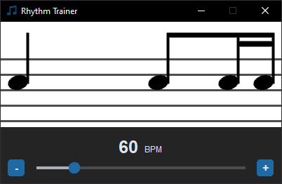

# Rhythm Trainer

## Description
This app was inspired by [Talking Bass 16th note rhythm exercise](https://www.talkingbass.net/6-essential-16th-note-rhythms-you-need-to-learn/).
In this exercise the goal is to learn how to subdivide beat into 16th notes.

This app was created to prevent memorizing given sequence of subdivisions, by generating infinite sequence of notes to play with built in metronome. 

### Features
- Infinite sequence of subdivisions
- Metronome
- Tempo selector

### Built with
- Tkinter
- CustomTkinter

### GUI 
The GUI consists of 2 groups of notes, BPM counter, and BPM selector, with slider and buttons for more precision.

Left group of notes is the one you are supposed to play. Right group is the preview of incoming notes, which will move to the left on metronome beep. 

The pitch of notes does not matter, they are only for visual aid, this exercise focuses mostly on rhythm.

    

